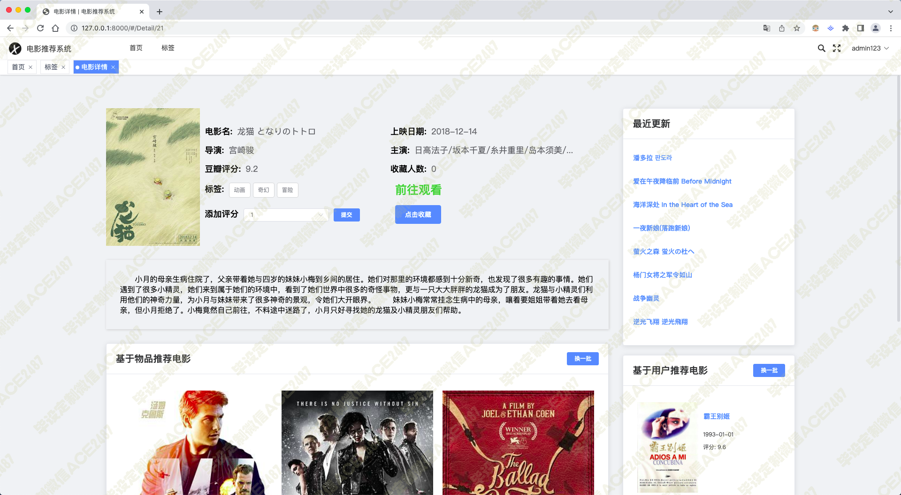
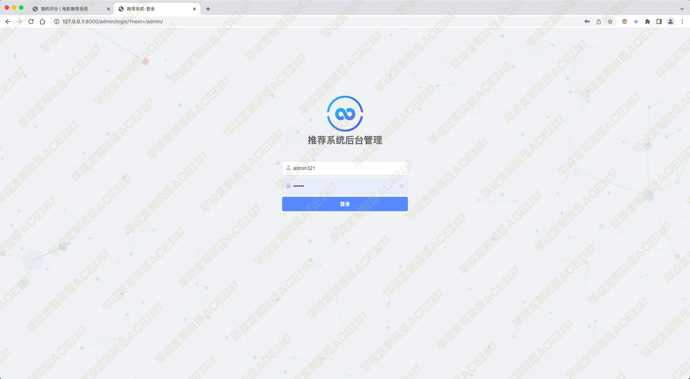

# 008 基于爬虫与协同过滤电影推荐系统-毕业设计展示

> **代码有偿获取 可接受定制 微信联系方式: csbysj2020 或 ACE2487，备注(毕设)**

> 

> 

## 技术栈
python django javascript scrapy vue elementui simpleui svd 基于物品与基于用户推荐 协同过滤 推荐算法 机器学习

影片显示、影片分类显示、热门影片排序显示、收藏影片排序显示、时间排序显示、评分排序显示、算法推荐、影片搜索、影片信息管理 后台管理数据 电影数据爬虫 随时更新最新数据

## 视频

> **点击查看 \>\>\> [https://www.bilibili.com/video/BV1p94y1S7ad/](https://www.bilibili.com/video/BV1p94y1S7ad/)**

## 截图

